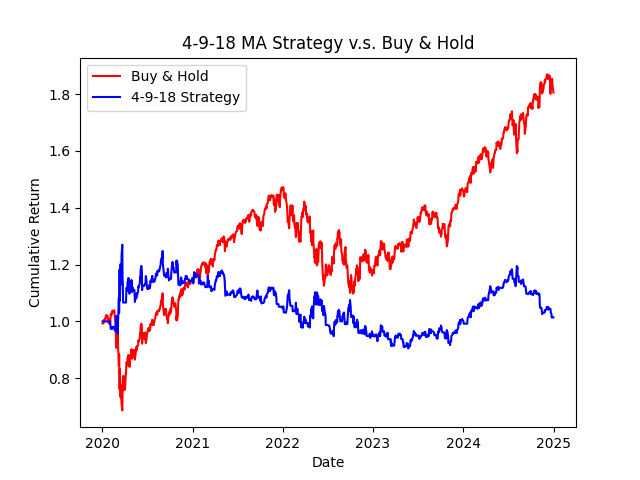

# Title
MA Strategy - S&P500
# Introduction
運用 R.C.Allen 在1970年代提出的4-9-18三均線策略，分析單純持股與此策略的累積報酬
# Strategy
建立一個移動視窗，將每一天的收盤價往前看n天形成小集合並計算平均。n = 4、9、18  
4天視為短期，9天為中期，18天為長期  
當短期 > 中期 > 長期 → 做多；短期 < 中期 < 長期 → 做空
# Data
資料來源：`yfinance`  
標的：S&P500 (^GSPC)  
區間：2020-01-01 ~ 2025-01-01
# Result
- **長期觀察 (2020–2025)**  
  - 單純持股的累積報酬率優於均線策略   

- **短期觀察 (2022–2023 下跌期間)**  
  - 假設在 2022-01-01 市場下跌時進場  
  - 發現此策略具備一定的抗跌效果
# visulization
- 長期 (2020 ~ 2025)

- 短期 (2022 ~ 2023)

# Conclusion
- 美股長期趨勢向上，因此單純持股表現優於均線策略  
- 均線策略因使用過去幾天的平均值，具一定延遲性，會錯過好的進出場時機  
- 在市場下跌時，均線策略表現較優，屬於防禦型策略  
- 未來可搭配其他指標，提升策略準確性